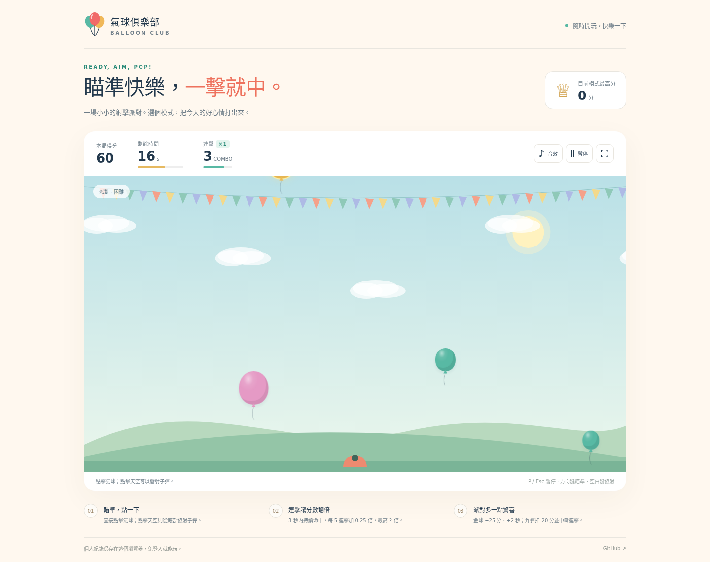
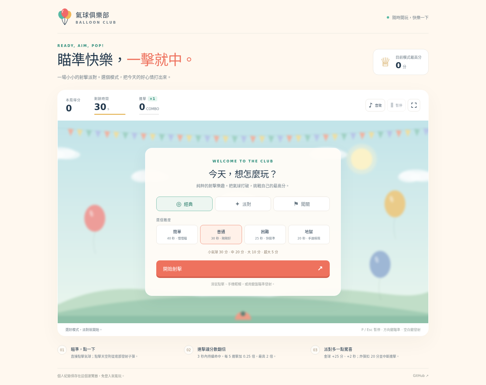
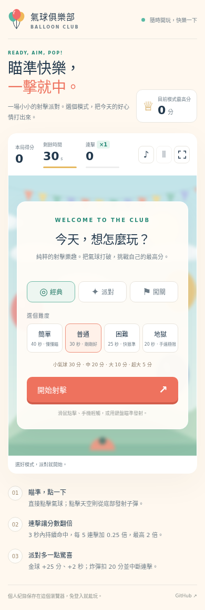

# 🎈 氣球俱樂部 · Balloon Club

免費、免登入的瀏覽器氣球射擊遊戲。保留原本四種難度，加入經典、派對與五關任務，並重新設計桌面與手機介面。

**[開始遊玩 →](https://jim-coming.github.io/balloon_game/)**



## 三種模式

| 模式 | 玩法 |
| --- | --- |
| 經典 | 純氣球射擊與連擊加分，適合練習瞄準、挑戰最高分 |
| 派對 | 加入金色氣球、加時與炸彈；簡單難度不出現炸彈 |
| 闖關 | 完成五個任務，逐關解鎖；通關後可直接挑戰下一關 |

經典與派對有簡單、普通、困難、地獄四種難度，分別為 40、30、25、20 秒。

### 計分規則

- 普通氣球依大小得到 30、20、10 或 5 分，越小越高分。
- 3 秒內持續命中形成連擊；每 5 連擊增加 0.25 倍分數，最高 2 倍。
- 金色氣球基本分數為 25 分，額外增加 2 秒，每局加時上限 10 秒。
- 炸彈扣 20 分（最低為 0），並中斷連擊；未命中的發射也會中斷連擊。
- 結算顯示得分、命中氣球、命中率、最高連擊、發射次數、未命中與飛走的氣球。
- 命中率 = 命中普通／金色氣球次數 ÷ 發射次數；炸彈不算有效命中。

### 五關任務

| 關卡 | 時間 | 通關條件 |
| --- | --- | --- |
| 1 · 暖身派對 | 40 秒 | 命中 8 顆氣球 |
| 2 · 找回節奏 | 35 秒 | 至少 200 分，最高連擊 5 |
| 3 · 黃金時刻 | 35 秒 | 命中 2 顆金球，至少 250 分 |
| 4 · 精準出擊 | 35 秒 | 命中 12 顆氣球，命中率至少 70% |
| 5 · 派對冠軍 | 35 秒 | 至少 500 分，最高連擊 8，炸彈命中不超過 1 次 |

任務在時間結束時判定，必須達成全部條件。第三關每第五次生成會提供金球，確保任務所需目標出現。關卡解鎖與個人最高分會保存在目前瀏覽器。

## 操作

| 操作方式 | 控制 |
| --- | --- |
| 滑鼠／手機 | 點擊或輕觸氣球，立即命中；點擊天空從底部發射子彈 |
| 鍵盤瞄準 | 遊戲區取得焦點後，以方向鍵移動準星，空白鍵／Enter 發射 |
| 鍵盤直接命中 | Tab 聚焦氣球後，空白鍵／Enter 命中 |
| 暫停／繼續 | P、Esc，或介面按鈕 |
| 音效與全螢幕 | 右上方按鈕；全螢幕功能依瀏覽器支援顯示 |

切換分頁時自動暫停，回來後由玩家選擇繼續。遊戲支援觸控、鍵盤焦點、對話框焦點循環與偏好減少動畫；手機使用較高的直式遊戲區，氣球保有可點擊的最小尺寸。

最高分依模式、難度與關卡分開記錄，音效偏好也會保留。若瀏覽器阻擋儲存，仍可遊玩，介面會說明紀錄僅保留在本次開啟期間。

## 畫面預覽

桌面選單：



<details>
<summary>手機版畫面</summary>
<p></p>
</details>

以上為 Chromium 實際執行此版本的截圖。可用 `npm run capture` 重新產生桌面、手機與遊玩預覽。

## 本機執行

遊戲只使用 HTML、CSS 與原生 JavaScript，執行時不需要框架、後端、外部圖片、字型服務或 API。

直接開啟 `index.html` 即可遊玩，或啟動本機伺服器：

```bash
git clone https://github.com/jim-coming/balloon_game.git
cd balloon_game
python3 -m http.server 8080 --bind 127.0.0.1
```

開啟 <http://127.0.0.1:8080>。若已安裝 Node.js，也可使用 `npm run dev`（同樣需要 Python 3）。

## 開發與測試

開發測試使用 Node.js 22 與 Playwright；遊戲執行本身不需要 npm 套件。

```bash
npm ci
npx playwright install chromium
npm test
npm run test:e2e
```

- **14 項核心規則測試**：不同更新率的速度／計時、暫停、延遲畫面、重複命中、連擊、金球加時、炸彈、零距離射擊、子彈連續碰撞、五關可完成性、重玩重設與實體數量上限。
- **14 項瀏覽器測試**：桌面與手機各 7 項，涵蓋所有模式／難度、滑鼠／觸控、結算、重玩、紀錄保存、首關解鎖、鍵盤、分頁自動暫停、靜音偏好及異常儲存。
- GitHub Actions 在 `main` 推送與 Pull Request 時執行相同檢查。

遊戲使用單一動畫迴圈與獨立狀態機；移動速度以秒計算，倒數使用實際經過時間，快速子彈使用線段碰撞以避免穿透氣球。

## 檔案結構

| 檔案 | 用途 |
| --- | --- |
| `index.html` | 介面、選單、HUD、暫停與結算畫面 |
| `styles.css` | 桌面／手機版面、氣球與命中特效 |
| `game-core.js` | 無 DOM 依賴的遊戲規則、物理、計分與任務 |
| `game.js` | 介面事件、Canvas 場景、音效與個人紀錄 |
| `favicon.svg` | 原生向量氣球圖示 |
| `tests/` | 核心及瀏覽器測試 |
| `scripts/capture-preview.cjs` | 實際瀏覽器截圖工具 |
| `docs/screenshots/` | README 的桌面、手機與遊玩畫面 |

## GitHub Pages

儲存庫的 GitHub Pages 使用 `main` 分支根目錄。所有資源使用相對路徑，支援 `/balloon_game/` 專案網址；不需額外建置。
